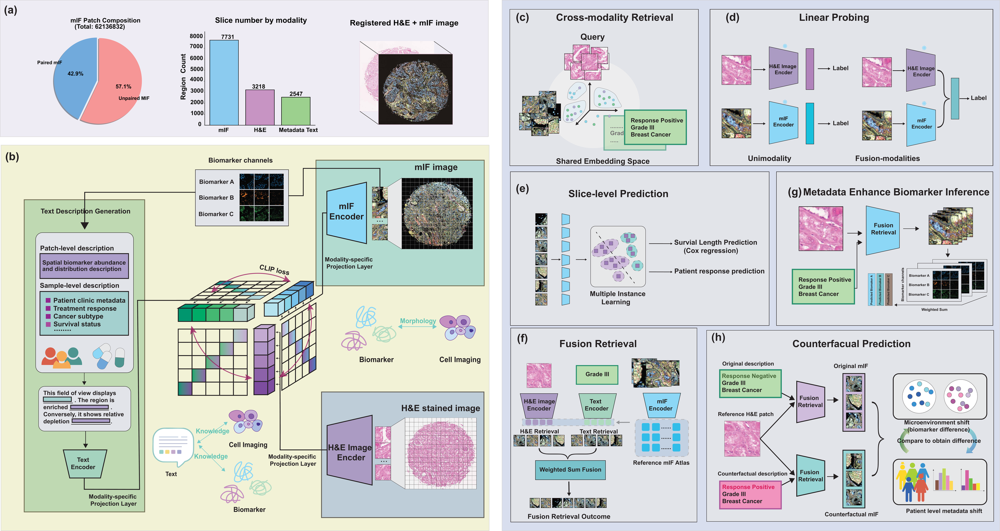

# 🎴 Haiku: Linking Spatial Biology and Clinical Histology

**A tri-modal contrastive learning model that aligns multiplexed immunofluorescence (mIF), H&E histology, and clinical text within a shared embedding space.**

<p align="center">
  
</p>

Integrating molecular, morphological, and clinical data is essential for translational biomedical research, yet systematic frameworks for jointly modeling these modalities remain limited. Haiku is pretrained on **26.7 million spatial proteomics patches** from **3,218 tissue sections**, enabling cross-modal retrieval, downstream clinical prediction, zero-shot biomarker inference, and counterfactual perturbation analysis.

<p align="center">
  
</p>

> **(a)** Training data composition and registered mIF + H&E images.
> **(b)** Tri-modal contrastive learning with modality-specific encoders and projection heads.
> **(c)** Cross-modality retrieval in shared embedding space.
> **(d)** Linear probing for unimodal and fused classification.
> **(e)** Slice-level MIL prediction for survival and treatment response.
> **(f)** Fusion retrieval combining H&E and text embeddings.
> **(g)** Metadata-enhanced biomarker inference via fusion retrieval + PCC.
> **(h)** Counterfactual prediction through in-silico metadata perturbation.

## ✨ Highlights

- 🔁 **Three-way cross-modal retrieval** across mIF, H&E, and clinical text
- 🧪 **Zero-shot biomarker inference** through fusion retrieval conditioned on metadata-only text descriptions that exclude explicit biomarker information
- 🧬 **Counterfactual prediction framework** that modifies clinical metadata while fixing tissue morphology, revealing niche-specific molecular remodeling programs associated with breast cancer stage progression and lung cancer survival outcome
- 📈 **Improved downstream performance** over unimodal baselines on classification and clinical prediction tasks

---

## ⚙️ Installation

```bash
conda env create -f environment.yml
conda activate haiku
```

### Requirements

- Python 3.11+
- PyTorch 2.6+
- CUDA 12.x (GPU recommended)

Key dependencies: `transformers`, `timm`, `omegaconf`, `h5py`, `tifffile`, `scikit-image`, `huggingface_hub`

---

## 🤗 Pretrained Weights & Demo Data on HuggingFace

Haiku ships as two gated-manual HuggingFace repos so you do **not** need to download MUSK or BiomedBERT separately or manage local demo data:

| Repo | Type | Size | Contents |
|---|---|---|---|
| [`zhihuanglab/Haiku`](https://huggingface.co/zhihuanglab/Haiku) | model | 3.2 GB | `haiku_state_dict.pt`, BiomedBERT tokenizer + config, `config.json`, ESM embeddings, vocab |
| [`zhihuanglab/Haiku-demo-data`](https://huggingface.co/datasets/zhihuanglab/Haiku-demo-data) | dataset | 3.5 GB | `codex_patches/`, `he_patches/`, `text/`, `example_slices/`, `demo_samples.json` |

Both repos are **gated (manual)** — request access on the repo page, then authenticate once:

```bash
hf auth login                  # or: export HF_TOKEN=hf_...
```

First run of any example notebook will download and cache the assets under `~/.cache/huggingface/`; subsequent runs are instant.

**One-liner model load** (replaces manual MUSK + BiomedBERT + checkpoint loading):

```python
from models import Haiku

model, tokenizer, marker_embedding = Haiku.from_pretrained(
    "zhihuanglab/Haiku", device="cuda",
)
model.eval()
```

---

## 🚀 Quick Start

### 🖼️ 1. Patch Visualization

[`example_retrieval/patch_visualization.ipynb`](example_retrieval/patch_visualization.ipynb) -- Visualize preprocessed CODEX + H&E patches with multi-channel biomarker overlays and whole-region mosaics. Data auto-downloads from `zhihuanglab/Haiku-demo-data`.

### 🔎 2. Cross-Modal Retrieval

[`example_retrieval/case_example.ipynb`](example_retrieval/case_example.ipynb) -- Load the pretrained Haiku model via `Haiku.from_pretrained("zhihuanglab/Haiku")`, extract trimodal embeddings across 4 tissue regions (959 patches), and run Text-to-CODEX and H&E-to-CODEX retrieval with ground-truth comparison (Text→CODEX R@1=0.065/R@5=0.244, H&E→CODEX R@1=0.343/R@5=0.719).

### 📊 3. Downstream Analysis

[`downstream/`](downstream/) -- Biomarker inference (fusion PCC), linear probing, MIL classification/survival, and perturbation analysis.

Pre-executed notebooks with all outputs are provided as `*_executed.ipynb` for reference.

---

## 📁 Directory Structure

```
Haiku/
├── README.md
├── environment.yml
├── src/
│   ├── configs/config.yaml           # Model and training configuration
│   ├── models/
│   │   ├── haiku_model.py            # Haiku trimodal model
│   │   ├── encoders.py               # Text (BiomedBERT), mIF (VirTues), H&E (MUSK) encoders
│   │   └── embedding_module.py       # Marker embedding (ESM + learnable)
│   ├── data/dataset.py               # Dataset classes and collate functions
│   ├── utils/                        # Loss functions and transforms
│   ├── haiku/                        # Notebook utility package
│   └── virtues/                      # VirTues MAE encoder (submodule)
├── preprocessing/                    # Data preprocessing pipeline
│   ├── mask.py                       # CNN tissue segmentation
│   ├── codex_patch_single_region.py  # CODEX patch extraction
│   ├── he_patch_from_codex_ids.py    # H&E patch extraction
│   ├── text_gen_mp.py                # Text description generation
│   └── enhance_des.py                # Text enhancement
├── dataset/                          # Optional local copy of demo data; HF-hosted version is canonical
├── example_retrieval/                # Retrieval example notebooks (auto-download from HF)
└── downstream/                       # Downstream analysis notebooks
```

---

## 📦 Data

Demo data for **4 tissue regions** (959 registered CODEX + H&E + text patches) is hosted at [`zhihuanglab/Haiku-demo-data`](https://huggingface.co/datasets/zhihuanglab/Haiku-demo-data) and downloaded on demand by the example notebooks. For the full pretraining dataset, see our data release on [Zenodo](#) (link forthcoming).

Each patch consists of:
| Modality | Format | Shape | Description |
|----------|--------|-------|-------------|
| mIF (CODEX) | `.pkl` | (C, 256, 256) | 54-channel multiplexed immunofluorescence |
| H&E | `.npy` | (256, 256, 3) | Registered histology patch |
| Text | `.txt` | -- | Clinical metadata + biomarker expression narrative |

## 🔬 Preprocessing

To preprocess your own data from raw CODEX + H&E TIFFs, see the [preprocessing guide](preprocessing/README.md).

---

## 🧠 Model Architecture

| Component | Backbone | Embedding Dim |
|-----------|----------|:---:|
| mIF Encoder | VirTues (ViT MAE) | 512 |
| H&E Encoder | MUSK (ViT-Large) | 1024 |
| Text Encoder | BiomedBERT | 768 |
| Projection Heads | Per-modality MLP | 1024 |
| Marker Embedding | ESM + learnable | 1152 &rarr; 512 |

---

## 🙏 Acknowledgments

We gratefully acknowledge the following open-source projects that Haiku builds upon:

- **[MUSK](https://github.com/lilab-stanford/MUSK)** -- H&E vision encoder pretrained on large-scale pathology data
- **[VirTues](https://github.com/Boehringer-Ingelheim/VirTues)** -- Vision Transformer MAE for multiplexed tissue imaging
- **[BiomedBERT](https://huggingface.co/microsoft/BiomedNLP-BiomedBERT-base-uncased-abstract-fulltext)** -- Biomedical language model
- **[ESM](https://github.com/facebookresearch/esm)** -- Protein language model for marker embeddings

## 📑 Citation

If you use Haiku, please also cite the upstream models it builds on.

```bibtex
@article{haiku2026,
  title={Linking Spatial Biology and Clinical Histology via Haiku},
  author={...},
  year={2026}
}

@article{gu2021biomedbert,
  author  = {Gu, Yu and Tinn, Robert and Cheng, Hao and Lucas, Michael and Usuyama, Naoto and Liu, Xiaodong and Naumann, Tristan and Gao, Jianfeng and Poon, Hoifung},
  title   = {Domain-Specific Language Model Pretraining for Biomedical Natural Language Processing},
  journal = {ACM Transactions on Computing for Healthcare (HEALTH)},
  year    = {2021},
  note    = {Previously known as PubMedBERT. Model used: \texttt{microsoft/BiomedNLP-BiomedBERT-base-uncased-abstract-fulltext}.},
  eprint  = {2007.15779},
  archivePrefix = {arXiv},
}

@article{xiang2025musk,
  author  = {Xiang, Jinxi and Wang, Xiyue and Zhang, Xiaoming and Xi, Yinghua and Eweje, Feyisope and Chen, Yijiang and Li, Yuchen and Bergstrom, Colin and Gopaulchan, Matthew and Kim, Ted and Yu, Kun-Hsing and Willens, Sierra and Olguin, Francesca Maria and Nirschl, Jeffrey J. and Neal, Joel and Diehn, Maximilian and Yang, Sen and Li, Ruijiang},
  title   = {A Vision-Language Foundation Model for Precision Oncology},
  journal = {Nature},
  year    = {2025},
  note    = {MUSK. H\&E encoder used in Haiku: \texttt{hf\_hub:xiangjx/musk}.},
}

@article{wenckstern2025virtues,
  author  = {Wenckstern, Johann and Jain, Eeshaan and Cheng, Yexiang and von Querfurth, Benedikt and Vasilev, Kiril and Pariset, Matteo and Cheng, Phil F. and Liakopoulos, Petros and Michielin, Olivier and Wicki, Andreas and Gut, Gabriele and Bunne, Charlotte},
  title   = {AI-powered virtual tissues from spatial proteomics for clinical diagnostics and biomedical discovery},
  journal = {arXiv preprint arXiv:2501.06039},
  year    = {2025},
  note    = {VirTues. Used as the mIF (CODEX) encoder backbone in Haiku.},
  eprint  = {2501.06039},
  archivePrefix = {arXiv},
}
```
